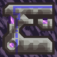

# Epsilon
Epsilon - is a Mindustry modification which introduces you unique style of plot-based gameplay. It adds: A whole new star system, pretty unique mechanics and more!
Main planet in this star system is a Kallistea. 1st planet in Epsilon system. It is a terra planet with plenty of biomes, and even lifeforms!

Who knows what mysteries will you have to solve.

Also join our discord server if you've got any questions or found bugs. Or just want to talk with our team!

## ItzJustaTeam (or people who contributed to Epsilon)
Owners: Cirrostratus(Nahan), ItzCraft
Coders: ItzCraft, AnDashik, Weersix, alnyle
Spriters: Cirrostratus(Nahan)
Music producer: Ace1020Spawn
Translators: Kevin Vilyan, ItzCraft
Contributors: Sputnuc
